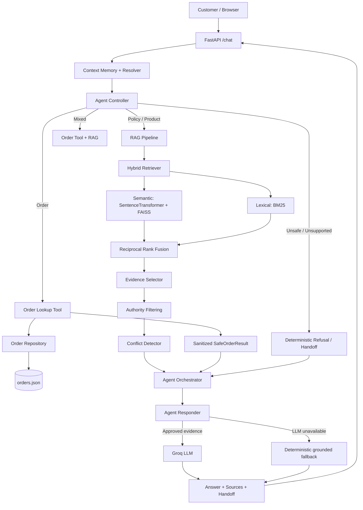

# AsterGuard — Reliable RAG Support Agent for Aster & Row

> Take-home project: a reliability-first customer-support agent built over a Markdown knowledge base and mock order data for the fictional ecommerce company **Aster & Row**.

AsterGuard answers policy/product questions from a Markdown knowledge base, looks up order status through a privacy-safe tool, keeps light-weight multi-turn context, and **refuses to guess** when sources conflict, evidence is missing, or a request crosses a privacy boundary.

The project optimizes for **groundedness, deterministic safety checks, source authority, privacy, and regression coverage** — not feature count or UI polish.

---

## Demo

*One screenshot per required scenario — a knowledge-base answer with citations, an order lookup, a multi-turn follow-up, and a safe refusal / human handoff.*

| Knowledge-base question + citations | Order lookup |
|---|---|
|  |  |

| Multi-turn follow-up | Safe abstention / human handoff |
|---|---|
|  |  |

*(Screenshots above show the working conversation; see [`§ Production Improvements`](#production-improvements) for the still-missing video walkthrough.)*

---

## Video

*2–4 minute demo video/GIF walkthrough of the full conversation flow.*

| Demo video |
|---|
| [Watch the video walkthrough](video/final_video.mp4) |

---

## Table of Contents

- [What It Does](#what-it-does)
- [Reliability Principles](#reliability-principles)
- [Tech Stack](#tech-stack)
- [Architecture](#architecture)
- [Setup From a Clean Clone](#setup-from-a-clean-clone)
- [Environment Variables](#environment-variables)
- [Running the App](#running-the-app)
- [API](#api)
- [Running Tests & Evaluations](#running-tests--evaluations)
- [Bug Diary](#bug-diary)
- [Requirement Coverage](#requirement-coverage)
- [Known Limitations](#known-limitations)
- [Production Improvements](#production-improvements)
- [AI Coding Tools Used](#ai-coding-tools-used)
- [Repository Structure](#repository-structure)

---

## What It Does

| Category | Example | Behavior |
|---|---|---|
| **Knowledge-base Q&A** | "What is your return policy?" | Answers only from retrieved evidence, cites `filename + heading` |
| **Order lookup** | "Where is ORD-1007?" | Looks up one order via a tool; model never sees the full `orders.json` |
| **Mixed order + policy** | "Can I still return ORD-1005?" | Combines sanitized order fields (e.g. membership tier) with policy retrieval |
| **Multi-turn follow-up** | "Do you ship internationally?" → "What about Canada?" | Resolves the follow-up using compact session state |
| **Safe refusal / handoff** | Conflicting Breeze Tumbler care instructions | States the conflict, cites both sources, recommends a human |

---

## Reliability Principles

The four failure modes named in the brief map directly to design decisions:

| Reported problem | How AsterGuard addresses it |
|---|---|
| Conflicting policy answers | Deterministic **source-authority layer** prefers active/official docs; genuine conflicts between two current sources are **surfaced, not silently resolved** |
| Invented order info | Order facts come **only** from a narrow, read-only lookup tool returning a sanitized `SafeOrderResult` — never the raw file |
| Lost conversation context | A compact `SessionState` (active order/topic/destination, last turns) resolves recognized follow-ups without dumping full transcript into every query |
| Unsafe retrieved content | Retrieved passages and user messages are treated as **untrusted data**; instructions embedded in documents are ignored |

The model is never the source of truth: company facts come from approved retrieved evidence, order facts come from the order service, and the LLM is optional — a deterministic fallback keeps the app answering (in a limited way) if the LLM provider is down.

---

## Tech Stack

| Layer | Choice |
|---|---|
| Backend | Python, FastAPI, Pydantic / pydantic-settings, Uvicorn |
| LLM | Groq (OpenAI-compatible API), model `openai/gpt-oss-20b`, temperature `0.1`, max tokens `300` |
| Embeddings | `sentence-transformers` (`all-MiniLM-L6-v2`), normalized vectors, **FAISS `IndexFlatIP`** — with a deterministic hashed bag-of-words fallback if FAISS/SentenceTransformers can't initialize |
| Lexical retrieval | `rank-bm25` |
| Hybrid fusion | Reciprocal Rank Fusion (RRF) over semantic + lexical rankings |
| Storage | Local FAISS index + `indexes/chunks.json` (no vector DB); orders from `data/orders.json`; sessions in an in-memory dict |
| Frontend | Plain HTML/CSS/JS served by FastAPI |
| Testing | `pytest`, deterministic unit + regression assertions |

---

## Architecture



**Request flow, briefly:** validate request → load/create session → resolve compact follow-up context → route deterministically (policy / order / mixed / blocked) → run only the needed capability → apply safety checks (conflict, insufficient evidence, unknown order, privacy) → generate the response (LLM with approved evidence, or deterministic fallback) → update session memory.

Two design choices carry most of the reliability weight:

- **RAG is chunked by `##` heading**, keeps YAML front-matter metadata (status, authority, audience) on every chunk, and is retrieved via hybrid semantic+lexical search — but candidates are *filtered by authority before generation*, not just ranked by similarity.
- **Order data never reaches the model whole.** The tool returns a narrow, privacy-safe projection, and cancelled/returned orders have stale ETA/carrier fields stripped before the response is built.

---

## Setup From a Clean Clone

**Prerequisites:** Python 3.11–3.13, Git, and (optionally) a Groq API key — deterministic tests and most non-LLM behavior work without one.

```bash
# 1. Clone
git clone <YOUR_GITHUB_REPOSITORY_URL>
cd asterguard-rag-support-agent

# 2. Create and activate a virtual environment
python3 -m venv .venv
source .venv/bin/activate        # Windows: .\.venv\Scripts\Activate.ps1

# 3. Install dependencies
python -m pip install --upgrade pip
pip install -r requirements.txt

# 4. Configure environment
cp .env.example .env             # Windows: Copy-Item .env.example .env
# then add your GROQ_API_KEY to .env

# 5. Build the retrieval index
python scripts/build_index.py

# 6. Run tests
python -m pytest -q

# 7. Start the app
uvicorn app.main:app --reload
```

Open **http://127.0.0.1:8000**.

---

## Environment Variables

| Variable | Required | Default | Purpose |
|---|---:|---|---|
| `GROQ_API_KEY` | for LLM generation | — | Groq API credential |
| `GROQ_MODEL` | no | `openai/gpt-oss-20b` | model served through Groq |
| `APP_ENV` | no | `development` | application environment |
| `LOG_LEVEL` | no | `INFO` | logging level |
| `KNOWLEDGE_BASE_DIR` | no | `knowledge-base` | knowledge-base directory |
| `ORDERS_FILE` | no | `data/orders.json` | order data path |

`.env.example`:

```dotenv
GROQ_API_KEY=
GROQ_MODEL=openai/gpt-oss-20b
APP_ENV=development
LOG_LEVEL=INFO
KNOWLEDGE_BASE_DIR=knowledge-base
ORDERS_FILE=data/orders.json
```

> `.env` is git-ignored. Never commit a real key; rotate any key that was ever pushed publicly.

---

## Running the App

```bash
uvicorn app.main:app --reload
```

- Chat UI: `http://127.0.0.1:8000/`
- Health check: `GET /health`

Developer utilities for inspecting retrieval:

```bash
python scripts/inspect_kb.py     # parsed KB metadata / chunks
python scripts/search_kb.py      # ad-hoc retrieval candidates + scores
```

---

## API

**`GET /health`**
```json
{ "status": "ok", "service": "aster-row-support-agent" }
```

**`POST /chat`**
```json
// request
{ "session_id": "demo-session", "message": "Where is ORD-1007?" }

// response
{
  "session_id": "demo-session",
  "answer": "...",
  "blocked": false,
  "handoff": false,
  "sources": []
}
```

**`DELETE /sessions/{session_id}`** — clears server-side memory for a conversation.

---

## Running Tests & Evaluations

```bash
python -m pytest -q      # full suite
python -m pytest -v      # per-test visibility
```

**Current result: `88 passed`**, broken down by module:

| Area | Passing |
|---|---:|
| Agent routing / controller | 14 / 14 |
| Agent orchestration | 9 / 9 |
| Source authority | 5 / 5 |
| Conflict detection | 3 / 3 |
| Conversation context | 6 / 6 |
| Evidence selection | 4 / 4 |
| Order lookup tool | 8 / 8 |
| Order service / privacy | 9 / 9 |
| Index / chunk persistence | 2 / 2 |
| RAG pipeline | 2 / 2 |
| Response generation / fallback | 9 / 9 |
| Retrieval quality | 5 / 5 |
| UX / regression cases | 12 / 12 |
| **Total** | **88 / 88** |

**Baseline vs. final:** an early baseline snapshot by category wasn't preserved in this repository — only the final `88/88` result is verifiable. Preserving a first-run snapshot before major fixes is the top item under [Production Improvements](#production-improvements).

**`evaluation/visible-cases.json` coverage:** every supplied case's *behavior* is represented in the pytest suite, plus original regression cases beyond the supplied wording. A dedicated `evaluation/run_evaluation.py` that loads the JSON directly and prints a category report by ID is not yet built — see [Known Limitations](#known-limitations).

---

## Bug Diary

### 1 — "ordered" mistaken for an order-status request
- **Repro:** *"My TrailPlus membership was active when I ordered. What is my return window?"*
- **Root cause:** a broad order-intent keyword rule matched the word "ordered" inside ordinary phrasing, not just genuine tracking requests.
- **Fix:** order intent now requires narrower patterns (explicit order IDs, "where is my order", tracking/delivery-estimate language); policy routing stays separate.
- **Regression test:** `test_user_experience_regressions.py::test_ordered_word_does_not_trigger_order_lookup`

### 2 — Raw chat history contaminating a new retrieval query
- **Repro:** ask about `ORD-1007`, then ask an unrelated *"What is covered?"* in the same session.
- **Root cause:** conversation memory was treated as a raw transcript, so old order IDs/wording leaked into unrelated retrieval.
- **Fix:** `ContextResolver` now injects only compact, relevant fields for recognized follow-ups instead of appending full history.
- **Regression test:** `test_user_experience_regressions.py::test_context_resolver_does_not_copy_raw_history_into_new_query`

### 3 — Cancelled orders leaking stale ETA/tracking data
- **Repro:** *"When will order ORD-1004 arrive?"* (a cancelled order).
- **Root cause:** raw order fields were returned without checking current status, so a cancelled order could still show a delivery estimate.
- **Fix:** the order service strips carrier/tracking/ETA fields for cancelled or returned orders before the response is generated.
- **Regression tests:** `test_user_experience_regressions.py::test_cancelled_order_is_sanitized_before_responder`, `test_responder.py::test_cancelled_order_does_not_expose_eta`

### 4 — Damaged final-sale item misread as order tracking
- **Repro:** *"A final-sale bag arrived with a broken zipper yesterday. Am I completely out of luck?"*
- **Root cause:** shipping-adjacent words ("arrived") over-weighted the order-tracking intent even when no order lookup was actually requested.
- **Fix:** controller now recognizes damaged/final-sale language as a policy intent unless an explicit order ID or tracking phrase is present.
- **Regression test:** `test_user_experience_regressions.py::test_damaged_final_sale_is_policy_not_order_tracking`

### 5 — Mixed policy questions needed order context without leaking private data
- **Repro:** *"Can I still return ORD-1005?"*
- **Root cause:** a pure policy lookup missed that the order carried a TrailPlus membership (which changes the applicable window), but passing the full order record to the model would leak private fields.
- **Fix:** the mixed-query path fetches a *sanitized* order result first; only safe fields (membership tier, item category) are used to steer policy retrieval.
- **Regression test:** `test_user_experience_regressions.py::test_mixed_return_uses_order_membership_to_retrieve_trailplus_policy`

---

## Requirement Coverage

<details>
<summary>Full checklist (click to expand)</summary>

**RAG**
- [x] Split/index supplied Markdown, preserve front matter
- [x] Retrieve passages, not the full corpus
- [x] Prefer authoritative/active sources
- [x] Cite filename + heading on every policy/product answer
- [x] Abstain when evidence is insufficient
- [x] Surface genuine active-source conflicts
- [x] Source files left unmodified

**Order lookup**
- [x] Uses `data/orders.json` via a tool, not raw in-prompt
- [x] Asks for a missing order ID
- [x] Handles malformed/unknown IDs safely
- [x] Normalizes case/whitespace
- [x] Current `status` is authoritative
- [x] Never invents a missing ETA
- [x] Strips stale delivery data for cancelled orders
- [x] Excludes email/address/risk score/internal notes
- [x] Read-only

**Multi-turn**
- [x] Session-specific state, bounded recent history
- [x] Order and topic follow-ups resolved
- [~] General follow-up resolution is heuristic, not a full dialogue-state tracker

**Prompting / agent behavior**
- [x] User messages and retrieved passages treated as untrusted
- [x] Instructions inside documents ignored
- [x] Prompt/secret/internal-data requests refused
- [x] Company answers grounded in company data
- [x] Concise clarification when info is missing
- [x] Handoff on conflict/insufficient evidence/unsupported action
- [x] Never claims an unsupported action (refund, cancellation, etc.) was completed

**Evaluation**
- [x] One-command pytest suite, deterministic assertions
- [x] Original cases beyond supplied wording
- [x] 88/88 passing, reported per-module
- [ ] Dedicated `visible-cases.json` runner with category output
- [ ] Preserved baseline score by category

**Observability**
- [x] Manual retrieval-inspection script (`scripts/search_kb.py`)
- [~] Core objects carry enough data to inspect decisions in tests/debugging
- [ ] Structured per-request debug trace not yet wired into the API path

**Interface**
- [x] Minimal web UI showing answer, sources, handoff state

**README**
- [x] Setup, env vars, stack, architecture, eval command, results, bug diary, limitations, AI-tool disclosure
- [ ] Real `.env.example` file committed
- [ ] 2–4 minute demo video/GIF embedded (screenshots above are a stand-in)

</details>

---

## Known Limitations

- **Context resolution is heuristic**, not a general dialogue-state tracker — some natural follow-ups won't inherit context correctly. Documented deliberately, since guessing wrong context is worse than re-asking.
- **Session state is in-memory only** — lost on restart, not shared across workers.
- **No full structured request trace** wired into the API yet (retrieval scores/tool calls/fallbacks are inspectable in tests and dev scripts, not in a single per-request log).
- **`visible-cases.json` isn't auto-executed** by a dedicated runner yet; its behaviors are covered by the pytest suite instead.
- **Conflict detection is targeted**, not a general contradiction-detection engine — it reliably catches the kind of conflict seeded in this corpus (e.g. Breeze Tumbler care instructions), not arbitrary contradictions in a larger KB.
- **No vector DB, auth, rate limiting, or abuse controls** — out of scope for this assignment, but needed before production.

---

## Production Improvements

Roughly in priority order:

1. **Stronger conversation state** — explicit structured fields (`current_topic`, `current_order`, `current_destination`, …) with confidence-aware reference resolution instead of regex-driven follow-up detection.
2. **Structured observability** — one trace ID per request, JSON logs of message → resolved query → retrieval scores → tool calls → handoff/fallback (never logging secrets or internal order fields).
3. **A real `evaluation/run_evaluation.py`** that loads `visible-cases.json`, runs each case in its own session, asserts sources/tool calls/privacy/handoff, and prints per-case + per-category results.
4. **More paraphrase/property-based regression cases** ("And Canada?", "How many days there?", topic switches followed by stale pronouns, two order IDs in one conversation).
5. **Structured policy claims** (e.g. `{"policy": "standard_return_window", "value": 30, "unit": "days", "source": "..."}`) instead of free-text evidence, to strengthen conflict detection and output validation.
6. **Shared session store** (Redis, TTL-based).
7. **Index lifecycle**: checksums, versioned builds, atomic swap, rollback, automatic rebuild on KB changes.
8. **Output-level groundedness checks** — verify numeric/date/policy claims in the generated response against the evidence actually selected.
9. **Differentiated operational fallbacks** for LLM outage vs. retrieval outage vs. index corruption vs. genuine policy conflict, each with its own safe UX.

---

## AI Coding Tools Used

AI assistance was used for architecture discussion (separating RAG/tool/context layers), generating and reviewing test cases, debugging routing/follow-up edge cases, reviewing privacy behavior, and README completeness — all validated against deterministic tests rather than accepted as-is.

**A suggestion that was wrong/incomplete:** appending more prior chat history into each retrieval query was proposed to improve follow-up handling. In practice it also dragged stale order IDs and old topics into unrelated queries. The final design keeps a bounded recent-turns log for session context, but only injects *compact, relevant* state for recognized follow-ups — regression-tested by `test_context_resolver_does_not_copy_raw_history_into_new_query`. Lesson: more context isn't automatically better context.

---

## Repository Structure

<details>
<summary>Full tree (click to expand)</summary>

```text
.
├── .env.example
├── .gitignore
├── README.md
├── pytest.ini
├── requirements.txt
│
├── app/
│   ├── main.py                # FastAPI app, sessions, frontend mount
│   ├── config.py
│   ├── agent/
│   │   ├── controller.py      # deterministic routing / safety decisions
│   │   ├── intent.py          # intent patterns + order-ID extraction
│   │   ├── orchestrator.py    # RAG/tool execution + handoff logic
│   │   └── responder.py       # final answer generation + fallback
│   ├── context/
│   │   ├── memory.py          # compact durable conversation memory
│   │   └── resolver.py        # context injection for follow-ups
│   ├── llm/
│   │   ├── client.py          # Groq OpenAI-compatible client
│   │   └── prompts.py         # grounded/safe system prompt
│   ├── models/                # conflict, decision, document, order, retrieval, session
│   ├── orders/
│   │   ├── repository.py      # raw order loading
│   │   ├── schemas.py
│   │   └── service.py         # validation + safe projection
│   ├── rag/
│   │   ├── parser.py          # Markdown / front-matter parsing
│   │   ├── index.py           # embeddings + FAISS/fallback index
│   │   ├── lexical.py         # BM25 retrieval
│   │   ├── retriever.py       # semantic + lexical hybrid retrieval
│   │   ├── pipeline.py        # retrieval orchestration / query expansion
│   │   ├── evidence.py        # evidence selection
│   │   ├── authority.py       # source-authority policy
│   │   ├── conflicts.py       # genuine source-conflict detection
│   │   └── store.py           # persisted chunk store
│   └── tools/
│       └── order_lookup.py    # customer-safe read-only order tool
│
├── data/
│   ├── orders.json
│   └── orders-data-dictionary.md
│
├── evaluation/
│   └── visible-cases.json
│
├── frontend/
│   ├── index.html / script.js / style.css
│
├── indexes/
│   ├── chunks.json
│   └── faiss.index
│
├── knowledge-base/             # 14 supplied policy/product Markdown docs
│
├── scripts/
│   ├── build_index.py          # parse + embed + persist KB index
│   ├── inspect_kb.py           # inspect parsed KB metadata/chunks
│   └── search_kb.py            # inspect retrieval results
│
└── tests/                      # 13 pytest modules, 88 tests
```

</details>

---

**Project:** AsterGuard — Reliable RAG Support Agent
**Use case:** Aster & Row ecommerce customer support
**Core focus:** reliability, groundedness, safe abstention, privacy, retrieval quality, regression testing
